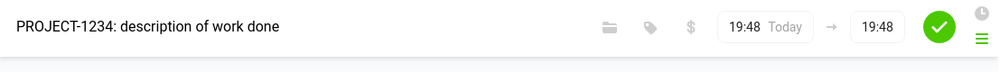

# Togira


## What it is

Togira is a web-based tool that allows to interactively import Toggl time entries into a Jira instance as Jira issue work logs.

It is meant for people who have to log their time in Jira, but prefer to use Toggl in their day to dat work, because of the much better experience.

This small project was an opportunity for me to learn new technologies (Vue.js and VueX, and some Express) while solving an actual problem I had and so making my life better.

I plan to maintain it as long as it is useful to myself.

Feedback and pull requests are welcome. 

## Features

Quick summary of what Togira has to offer:

- Web based
- Configure your Toggl account (username, API token)
- Configure a Jira server and account (Jira Cloud isn't supported at the moment!)
- Load time entries from Toggl for a given time period
- Detect Jira issue IDs in the description of the entries
- Interactively select entries to import in the UI
- Perform the import, i.e. add the time entries in Jira as work logs on their respective issue
- View a log of the import operation (especially see which imports might have failed)
- Retry the failed entries after fixing problems with the Jira issues (e.g. re-open the issue to allow work logs)
- Entries with the same date and with the same description are merged as a singe work log in Jira
- Optionally, mark entries in Toggl as already imported with a tag. These entries will then be recognized by Togira as already imported and will not be selectable for import again.

## How to use
### Requirements

#### Backend

There is a Docker image available, so all you need is to have Docker installed.

Image on Docker Hub: https://hub.docker.com/r/dockerzinho/togira

The app is exposed via HTTP on port 3000. To run the image:

```
docker run -p 3000:3000 -d dockerzinho/togira
```

Then access it in your browser at http://localhost:3000 (or whatever server you installed it on).

#### Front-end

Evergreen browsers should all work fine, but I develop and test only in Chrome (and derivatives) and sometimes in Firefox.

I have not made any effort to make it responsive or mobile-friendly in any way, so it will look ugly on small screens.

### Web UI

The first thing you will have to do is fill the configuration:


Most of the fields here are self-explanatory.

The Toggl API key can be found in your Toggl user profile.

One word about the label field in the Toggl section: you can select a Toggl label that will be added to every time entry that is successfully imported into Jira.

The label has to be created in Toggl first. If left empty, then no label will be added.

Togira will detect the label when it loads entries from Toggl, and entries with the label will have the status "Imported" and will not be selectable for import again.

_Warning: All the configuration values are stored in the borwser's local storage. As these contain sensible data, be careful and if necessary wipe your browser's private data after using Togira! I plan to add a button to manually reset the config._

Once you are finished with the configuration, it's time to load Toggl entries. Click on the "TOGGL ENTRIES" menu entry and then click the "Load Toggle Entries button":
 


This will load all the Toggl entries for the selected period, for which a Jira issue ID could be found in the description.

Important: For it to be recognized, the Jira issue ID should be at the beginning of the entry description like this:



How it is separated from the rest of the description (a special character like ":" or "-" or just space) doesn't matter.

On the Toggl entries screen, you see all the toggle entries for the selected period, grouped by day.
 
 
 
You can change the period using the select menu:


The buttons on the left allow you to reload the entries, select all (selectable) entries or deselect all entries.

You can also select any entry by clicking anywhere on it, except the Jira issue ID which is a link to the Jira issue itself.

The icon on the left of each entry shows the entry's status: incoming, imported or ongoing. Only the incoming entries can be imported to Jira. The imported status is determined through the Toggl tag mentioned above in the configuration section.

Once you have selected the entries you want to import, click on the "Import selected entries" button.

You will get to the import page. For a brief moment, a progress bar will be shown, and then you'll see the result of the import operation:


If there are entries that failed to import, there are listed here. 

Sometimes, the import fails because there is a problem with the Jira issue, for example the issue is closed and needs to be re-opened to allow for time logging. The Jira issue links allow you to quickly acces the failed issues, and the retry button allows you to retry the import once the problems are resolved.

The back button takes you back to the toggle entries list.

That's it. Enjoy! 

## Development

For development, or to run locally without using Docker:

Clone this repository.

Open a command line, cd into the repository, and execute:

```
./start.sh
```

This will build the front-end and start the backend.

### Development Vue JS server

Cd into the front-end directory and run the following command:
```
cd frontend
npm run serve
```

You can now access the app on http://localhost:8080/

### Server proxy

To prevent security problems, cross-domain AJAX requests are mostly blocked. To work around this, all API (Toggl and Jira) requests are made to the Togira server (e.g. localhost:8080) and the server is configured to forward those requests to the corresponding Toggl and Jira API endpoints.

Besides this proxying of the API requests and the serving of the static HTML/JS/CSS app, Togira does not have its own backend code. There is no database or any other form of server storage or logic.